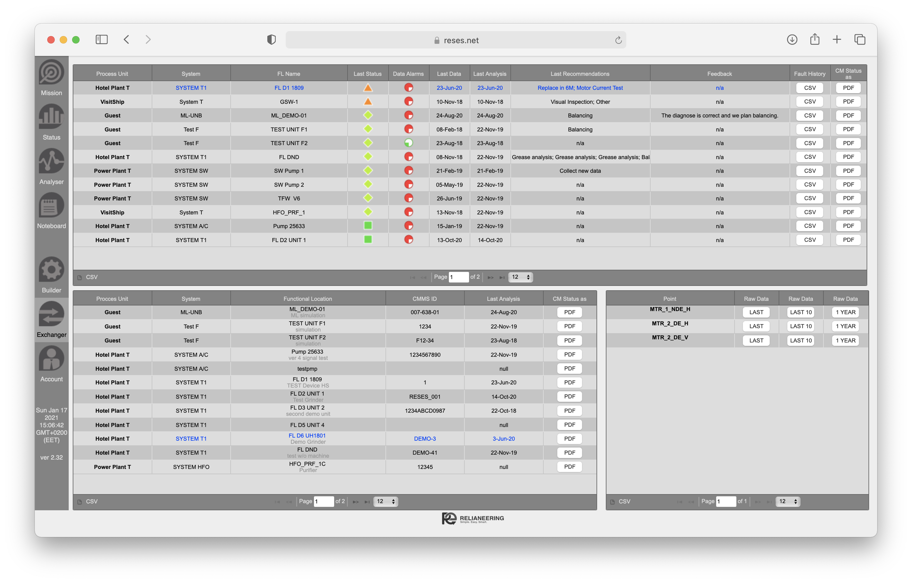

# Advanced CM tools
The tools use ReSES.net platform CM Point export data.
The tools are designed to support deep data analyses.

- [tPlot](./tplot/) - Time signal turns plot.
- [vSPlot](./vsplot/) - Velocity spectra plot.
- [aSPlot](./asplot/) - Acceleration spectra plot.
- [eSPlot](./esplot/) - sE (smart Enveloping) spectra plot.

To get tools input files the user of ReSES.net platform has to:
- Select Site
- Open Exchanger section
- Select Functional Location from the bottom left table
- Select CM Point from bottom right table
- Press one of (Last) (Last 10) (1 year) buttons to get zipped data
- Unzip the data, and move the files in the directory of the tool
- Follow the instructions how to use the tool

