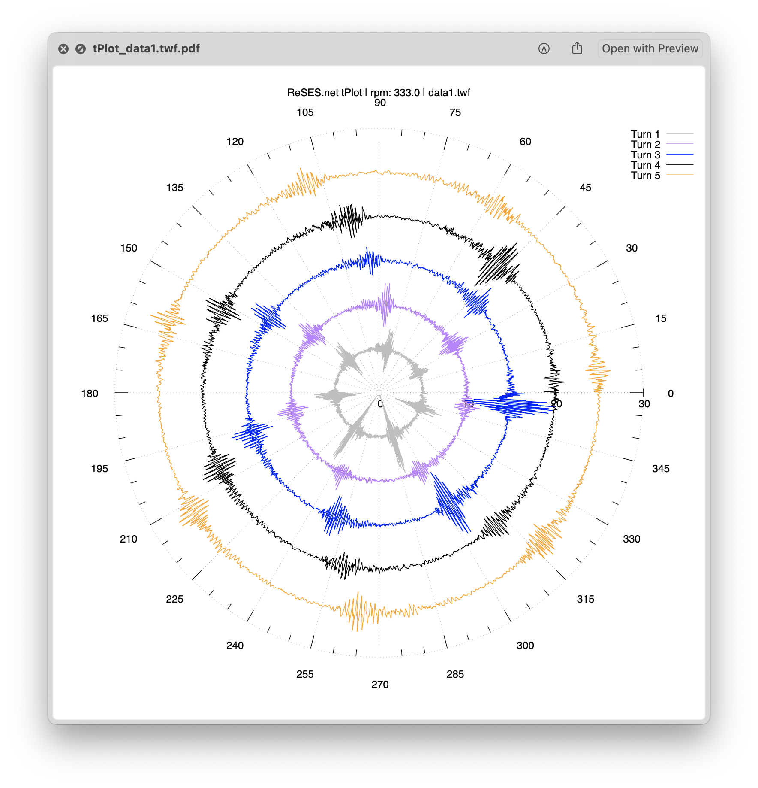

# Signal Polar Plot

## Dependecies
- [gnuplot](http://www.gnuplot.info)

## Usage
To run
```sh
./tplot  [-r <rpm>] [-o <offset>] [-s <scale>] FILENAME
```
- `<rpm>` - the speed of the shat in rpm (default 5)
- `<offset>` - offset time signal and define distance between shaft turns (default 5)
- `<scale>` - shifts the time signal to be only positive values (default 1)
- `FILENAME` - CM Point export from ReSES.net platfrom (`.twf` format)

A PDF file will be created for each input file.

For example:
```sh
./tplot -r 333 -s 2 -o 5 *.twf
```
Reads all `.twf` files in the directory and generates polar plots in PDF format using the parameters.


