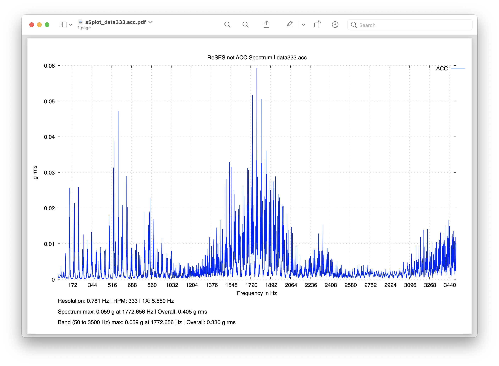

# Acceleration Spectrum Plot

## Dependecies
- [gnuplot](http://www.gnuplot.info)

## Usage
To run
```sh
./asplot  [-r <rpm>] [-s <startF>] [-e <endF>] FILENAME
```
- `<rpm>` - the speed of the shat in rpm (default 60)
- `<startF>` - start frequency (default 0)
- `<endF>` - start frequency (default 12000)
- `FILENAME` - CM Point export from ReSES.net platfrom (`.acc` format)

A PDF file will be created for each input file.

For example:
```sh
./asplot -r 333.0 -s 10 -e 10000 *.acc
```
Reads all `.acc` files in the directory and generates polar plots in PDF format using the parameters.

Use the file data333.acc to test the tool.
```sh
./asplot -r 333.0 -s 50 -e 3500 data333.acc
```


