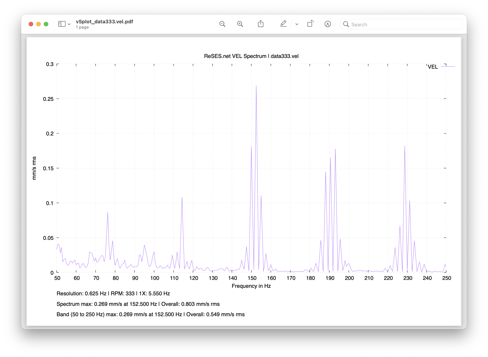

# Velocity Spectrum Plot

## Dependecies
- [gnuplot](http://www.gnuplot.info)

## Usage
To run
```sh
./vsplot  [-r <rpm>] [-s <startF>] [-e <endF>] FILENAME
```
- `<rpm>` - the speed of the shat in rpm (default 60)
- `<startF>` - start frequency (default 0)
- `<endF>` - start frequency (default 1000)
- `FILENAME` - CM Point export from ReSES.net platfrom (`.vel` format)

A PDF file will be created for each input file.

For example:
```sh
./vsplot -r 333.0 -s 10 -e 1000 *.vel
```
Reads all `.vel` files in the directory and generates polar plots in PDF format using the parameters.

Use the file data333.twf to test the tool.
```sh
./vsplot -r 333.0 -s 50 -e 250 data333.vel
```


